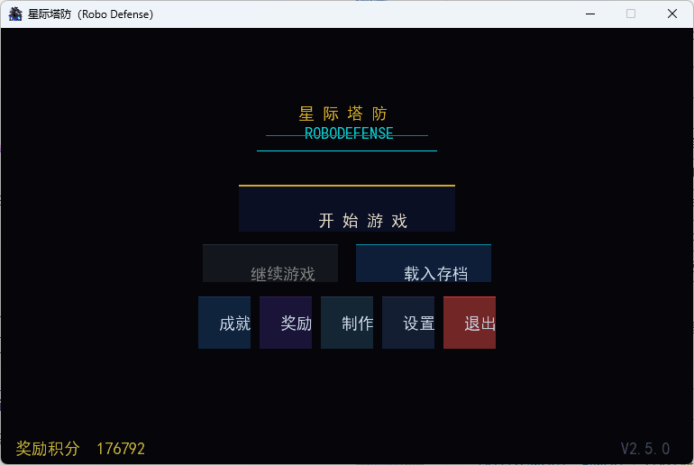
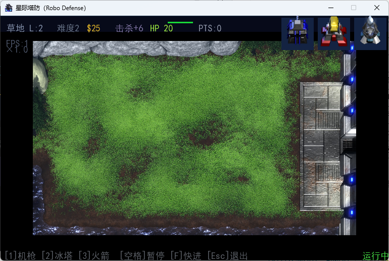
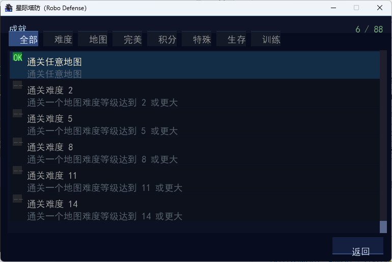
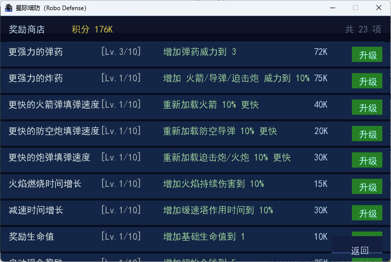

# 星际塔防 · Robo Defense

> 经典 2D 塔防游戏 | libGDX 桌面版 | 原版 Android APK 移植重构

---

## 游戏简介

星际塔防（Robo Defense）是一款经典的 2D 塔防游戏。玩家在网格地图上策略性地放置、升级防御塔，阻止敌人突破防线。游戏支持 7 种地图、23 种防御塔、11 种敌人类型、88 项成就和 23 种奖励升级。

原作为 Android 平台游戏（MagicWach, v2.5.0），本项目将其完整迁移至桌面平台，基于 libGDX 框架重构，核心逻辑 100% 平台无关。

### 截图

| 主菜单 | 游戏界面 |
|--------|---------|
|  |  |

| 成就 | 奖励商店 |
|------|---------|
|  |  |

> 运行 `java -jar desktop.jar` 体验

---

## 快速开始

### 环境要求

- **Java 8+** (推荐 JDK 17+)
- **操作系统**: Windows / macOS / Linux

### 下载与运行

```bash
# 方式一：直接运行 JAR
java -jar desktop.jar

# 方式二：从源码构建
./gradlew :desktop:dist
```

### 操作说明

| 操作 | 键位/方式 |
|------|----------|
| 放置防御塔 | 从右下角按钮拖拽到地图空格 |
| 升级/出售塔 | 点击已放置的防御塔 |
| 暂停菜单 | `ESC` |
| 快进（2x） | `空格` |
| 平移视角 | 鼠标拖拽地图空白处 |
| 缩放 | `↑` `↓` 方向键 |

---

## 游戏内容

7 张地图、23 种防御塔、11 种敌人、88 项成就与 23 种奖励升级的完整清单见
[docs/01-白皮书.md](docs/01-白皮书.md) §2 游戏内容。

---

## 开发

构建命令、调试参数与运行配置的权威说明统一收录在 [AGENTS.md](AGENTS.md)
（见其「构建与运行」「改代码前必读的坑」小节，归属依据 `docs/00-文档总纲.md` §3 矩阵），
本文件不重复展开。

---

## 文档

- 工程约定与文档索引：[AGENTS.md](AGENTS.md)
- 文档体系规则：[docs/00-文档总纲.md](docs/00-文档总纲.md)
- 产品定义与游戏内容：[docs/01-白皮书.md](docs/01-白皮书.md)
- 版本边界与路线图：[docs/02-版本边界与路线图.md](docs/02-版本边界与路线图.md)

## 许可证

本项目基于原版 Android APK (MagicWach, v2.5.0) 逆向工程和重构，仅供学习交流使用。原始游戏版权归原作者所有。

---

## 致谢

- **原版作者**: MagicWach — Android 平台《星际塔防》v2.5.0
- **桌面移植**: [turnarond](https://github.com/turnarond)
- **框架**: [libGDX](https://libgdx.com) — 跨平台游戏开发框架
- **字体**: SimHei (黑体) — 中文界面支持
- **反编译工具**: [jadx](https://github.com/skylot/jadx) — APK 逆向分析
